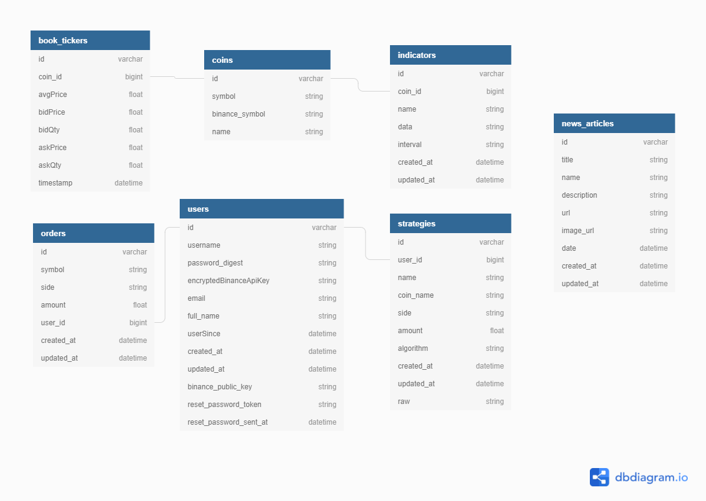

# Database Architecture

## Motivation

The motivation behind our database schema was that we needed an efficient way to store and process large amounts of data about our two main
focuses of our application: the users, and the coins. To do this, we created two main models which would be joined together within our
application and stored respective information about each in the form of connected database tables.

## Schema Overview

Our database is divided up into seven tables each containing data associated with the models in use in our application. The models that our
application currently uses are the following:

- Users
- Strategies
- Orders
- Coins
- Book Tickers
- Indicators
- News Articles

These models can be separated into three main categories that represent the database relationships between the models.

- Category 1: User-related models:
    - User has many Strategies, each Strategy belongs to a User
    - User has many Orders, each Order belongs to a User
- Category 2: Coin-related models:
    - Coin has many Book Tickers, each Book Ticker belongs to a Coin
    - Coin has many Indicators, each Indicator belongs to a Coin
- Category 3: News Articles:
    - The News Article model does not have a relationship with any other model

The utility of structuring the database in this way is that all of the models that convey information about a User are connected to 
the User model via a many to one relationship, and likewise models that convey information about a Coin are connected to a Coin via a many 
to one relationship.

Since the News Article model served solely to populate our home page with news articles requested via an API, there was no need to connect it via database relationships to any other model, and therefore we left it as a standalone table.

## Database visualization
Below is a visualization of the database schema that includes the table entries for each model:

