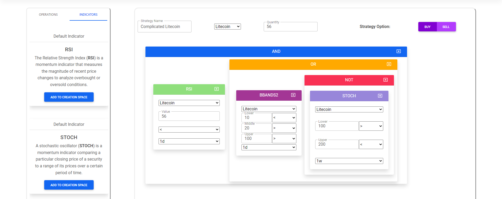

# Technical Description

## Technologies Used

### Key Ruby Gems

- **chartkick**: a means to display data in convenient graphs with data navigation. Used for displaying ask, bid, and average prices for select cryptocurrencies.

- **binance-ruby**: a way to make and manage data calls and requests to BinanceUS for crypto information and orders. Is and will continue to be migrated out as we implement a proxy-based approach to ordering cryptocurrency
  
- **digest**: used not only for user password encryption, but for encrypting user secret and public BinanceUS account keys

- **securerandom**: used for generating UUIDs on draggable cards

- **sidekiq-scheduler**: used in conjunction with Heroku to manage and schedule Rails tasks

### JavaScript/CSS

- **jQuery/jQuery-ui**: used for managing asynchronous, dynamic content updating without reloading pages. Used in high volume on the automatic strategy creation page

- **Bootstrap/MDBoostrap**: Mix of both used to style and give basic component functionality in our application. Dropodowns, modals, and button effects all utilize boostrap. MDB was more specifically used for styles in creating the look of certain components, as it offered a wider variety of implementation over Bootstrap

## Engineering Perspective and Challenges

### How is this application special?

The main thing about this application that sets it apart from a plain web application is its use of API interaction, order transactions, and a meta-programming, highly immersive and intuitive strategy creation GUI.

These three things make our website a place for a multitude of possibilities in cryptocurrency trading and strategy creation; not only can you create, but you can manage, update, and execute strategies to give you full control over your portfolio, something not even the biggest and best sites currently on the market in cryptocurrency offer.

### What was challenging?

The creation of the automated strategy GUI was by far the most difficult aspect of this project. It involved extensive `jQuery` and `jQuery-ui` setup in order to get interactions like `draggable`, `resizeable`, and `droppable`. Even once that process was set up in Rails 6, the issue was fine-tuning the configurations of each to create a smooth user experience.

However, the biggest challenge within that was linking the configuration and scripts to the Rails frontend. Simply using an `js.erb` file was not enough; we needed a mix of javascript within our HTML, a `js.erb` file, and other methods in our `/javascript/packs/application.js`. Then, the only issue was mapping the subset of the DOM containing the cards, sending it via post request to be processed into a JSON, and then store it in the database.

From there, we had to create an mini interpreter that would parse the JSON and construct a boolean expression that would determine whether or not the given strategy could execute. From there, we had a fully working automated strategy system that worked on a scheduler.

Those schedulers were another point of difficulty. Given limitations on Heroku, as well as API request/rate limits, we solved a series of optimizations to determine the best rates and times for which we could run our tasks on Heroku.

All of these together took an immense amount of time, but made the application so much better.

